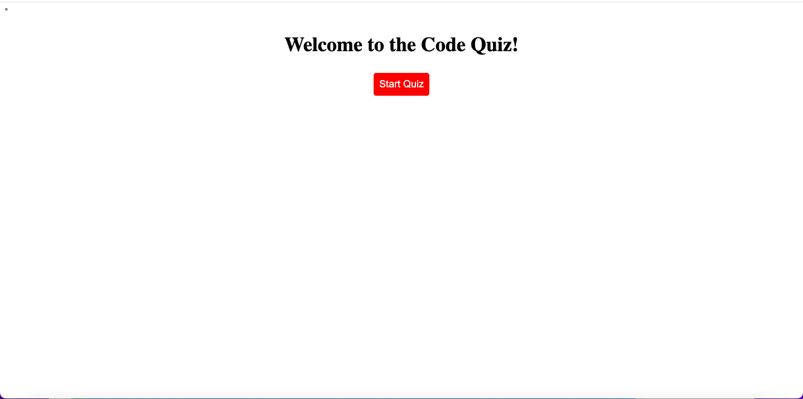

# Code-Quiz

## Description
My motivation for this project was to better my coding skills and also learn concepts that I will use in the future. I built this project to test my skills of building an application from scratch and practice how to create a detailed JavaScript file. This application solves the problem of wanting to test your skills on coding. Through a series of questions, you can test your knowledge and continually get better by beating previous high scores. While working on this project, I learned how to create a detailed JavaScript file that uses objects, click events, DOM elements, local storage elements, and timer intervals.

## Installation
To install this application go to the url "https://pjt3232.github.io/Code-Quiz/" on the browser of your choice.

## Usage
To use this application, go to the url "https://pjt3232.github.io/Code-Quiz/". The application should look like the screenshot below:

Then after you're on the deployed webpage, click the "Start Quiz" button to start the game. On the next screen, a question will be displayed with four multiple choice options and a timer will start. You must finish before the timer reaches 0 or the quiz will end. To choose an answer, jsut click the text of the multiple choice answer you think is correct. Once you select the answer, you will be moved onto the next question. For each question you get correct, you will gain 10 points and for each question answered wrong you will lose 10 seconds off your allotted time. Once you have answered all of the questions or ran out of time the screen will say "Game Over!" and ask you to enter your initials to save your high score. Once you enter your initials and click submit, the high scores list will show up and you can judge your score amongst your previous attempts. To try again, refresh the page and click the "Start Quiz" button again.

## Credits
I did not use a third party starter code for this project or have any collaborators.

